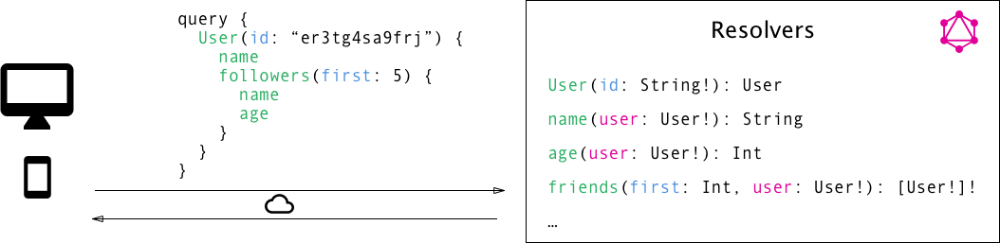

# Exam

## Vanilla JavaScript

### Explain the differences between Java and JavaScript. You should include both topics related to the fact that Java is a compiled language and JavaScript a scripted language, and general differences in language features
*You should include both topics related to the fact that Java is a compiled language and JavaScript a scripted language, and general differences in language features.*

||Java|JavaScript|
|-|-|-|
|Compiled vs Interpreted|Java is a compiled programming language.<br>Java is compiled into bytecode and run on a virtual machine|JavaScript is an interpreted scripting language.<br>JavaScript can be interpreted directly by a browser in the syntax it is written.|
|Static vs Dynamic Type Checking|Java uses static type checking, where the type of a variable is checked at compile-time. The programmer must specify the type (integer, double, string, etc.) of any variable they create.|JavaScript, like most scripting languages, uses dynamic typing, where type safety is verified at runtime. It is not required for a programmer to specify the type of any variable they create.|
|Concurrency|Java makes use of multiple threads to perform tasks in parallel.|JavaScript, particularly as it exists as Node.js in server-side applications, handles concurrency on one main thread of execution via a queue system called the event loop, and a forking system called Node Clustering.|
|Class Based vs Prototype Based|Java follows class based inheritance—a top down, hierarchical, class-based relationship whereby properties are defined in a class and inherited by an instance of that class.|In JavaScript, inheritance is prototypal—all objects can inherit directly from other objects. Hierarchy is accomplished in JavaScript by assigning an object as a prototype with a constructor function.|

### Explain the purpose of “use strict” and Linters, exemplified with ESLint
The "use strict" directive was new in ECMAScript version 5. It is not a statement, but a literal expression, ignored by earlier versions of JavaScript. The purpose of "use strict" is to indicate that the code should be executed in "strict mode". With strict mode, you can not, for example, use undeclared variables.

"Use strict" and linters are tools to protect us form ourselves. They warn us when our code contains a syntax error, and tells us if the variable we defined or assigned a value isn't being used. This improves the quality of our code, and may save time we would have use on debuging.

### Explain using sufficient code examples the following features in JavaScript. 
#### Variable/function-Hoisting
Hoisting means lifting up. A `var` declaration is lifted to the top of its scope.
```js
console.log(x)
var x = 10
```
is equivalent with
```js
var x
console.log(x)
x = 10
```
the declaration of x is hoisted not the assignment.
Like `var` declaration, a function is also hoisted

#### this in JavaScript and how it differs from what we know from Java/.net.
`this` in JavaScript typically refers to the function it is called in, while in Java it refers to the class.

```js
function Car(make,model) {
    this.make = make;
    this.model = model;
    this.show = function(){setTimeout(function(){ //This function gets it's own "this"
        console.log(this.make + ", " + this.model);
    },0)};
}
var car = new Car("Volvo","V70");
car.show();
```
output
```
undefined, undefined
```
if a function is defined as a arrow function it does not get its own `this`
```js
function Car(make,model) {
    this.make = make;
    this.model = model;
    this.show = function(){setTimeout(()=>{ //This function doesn't gets it's own "this"
        console.log(this.make + ", " + this.model);
    },0)};
}
var car = new Car("Volvo","V70");
car.show();
```
output
```
Volvo, V70
```

#### Function Closures and the JavaScript Module Pattern
##### Closures

A closure is an inner function that has access to the outer (enclosing) function's variables—scope chain. The closure has three scope chains: it has access to its own scope (variables defined between its curly brackets), it has access to the outer function's variables, and it has access to the global variables.  
The inner function has access not only to the outer function’s variables, but also to the outer function’s parameters. Note that the inner function cannot call the outer function’s arguments object, however, even though it can call the outer function’s parameters directly.

```js
function showName (firstName, lastName) {
    var nameIntro = "Your name is ";
        // this inner function has access to the outer function's variables, including the parameter
    function makeFullName () {
        return nameIntro + firstName + " " + lastName; 
    }
    return makeFullName ();
}
showName ("Michael", "Jackson");
```
output
```
Your name is Michael Jackson
```

##### Module Pattern

The Module pattern was originally defined as a way to provide both private and public encapsulation for classes in conventional software engineering.  
In JavaScript, the Module pattern is used to further emulate the concept of classes in such a way that we're able to include both public/private methods and variables inside a single object, thus shielding particular parts from the global scope. What this results in is a reduction in the likelihood of our function names conflicting with other functions defined in additional scripts on the page.

```js
var modularpattern = (function() {
	// your module code goes here
	var sum = 0

	return {
		add() {
			sum = sum + 1
			return sum
		},
		reset() {
			return (sum = 0)
		}
	}
})()
console.log(modularpattern.add())
console.log(modularpattern.add())
console.log(modularpattern.reset())
```
output
```
1
2
0
```

#### Immediately-Invoked Function Expressions (IIFE)
```js
(function(){/*do stuff*/})()
```

#### JavaScripts Prototype
```js
function Person(first, last, age, eye) {
	this.firstName = first
	this.lastName = last
	this.age = age
	this.eyeColor = eye
}

Person.prototype.name = function() {
	return this.firstName + ' ' + this.lastName
}

var newPerson = new Person('John', 'Doe', 50, 'blue')

console.log(newPerson.name())
```
output
```
John Doe
```

#### User-defined Callback Functions (writing your own functions that take a callback)
```js
function doHomework(subject, callback) {
	console.log(`Starting my ${subject} homework.`)
	callback()
}

doHomework('math', function() {
	console.log('Finished my homework.')
})
```
output
```
Starting my math homework.
Finished my homework.
```

#### Explain the methods map, filter and reduce
`Array.prototype.map()`: The `map()` method creates a new array with the results of calling a provided function on every element in the calling array.
```js
const numbers = [2, 3, 4, 5]
const mappedNumbers = numbers.map((e) => e * 2)
console.log(mappedNumbers);
```
output
```
[4, 6, 8, 10]
```

`Array.prototype.filter()`: The `filter()` method creates a new array with all elements that pass the test implemented by the provided function.
```js
const names = ['Lars', 'Jan', 'Peter', 'Bo', 'Frederik']
const filteredNames = names.filter(name => name.length <= 3)
console.log(filteredNames)
```
output
```
["Jan", "Bo"]
```

`Array.prototype.reduce()`: The `reduce()` method executes a reducer function (that you provide) on each member of the array resulting in a single output value.  

The reducer function takes four arguments:

1. Accumulator (acc)
2. Current Value (cur)
3. Current Index (idx)
4. Source Array (src)

Your reducer function's returned value is assigned to the accumulator, whose value is remembered across each iteration throughout the array and ultimately becomes the final, single resulting value.
```js
const numbers = [2, 3, 4, 5]
const reducer = (acc, cur, idx, src) => accumulator + currentValue)
console.log(numbers.reduce(reducer);
```
output
```
14
```

## Node.js + Express


### Explain generally about node.js, when it “makes sense” and npm, and how it “fits” into the node echo system
Node.js is a platform built on Chrome's JavaScript runtime for easily building fast, scalable network applications.  
It uses an event-driven, non-blocking I/O model that makes it lightweight and efficient, perfect for data-intensive real-time applications that run across distributed devices.

Node vs Java - similarities
- Runs on a Virtual Machine
- Runs on multiple platforms
- You must include packages before you can use them
- You must obtain packages not included in the base installation before you can use them

npm (short for Node.js package manager) is a package manager for the JavaScript programming language. It is the default package manager for the JavaScript runtime environment Node.js. It consists of a command line client, also called npm, and an online database of public and paid-for private packages, called the npm registry. The registry is accessed via the client, and the available packages can be browsed and searched via the npm website.

Many modules is designed to do one thing, the Node echo system encourages to use such modules instead of one module that does everything

### Explain about the Event Loop in Node.js
Node.js is a single-threaded application, but it can support concurrency via the concept of event and callbacks. Every API of Node.js is asynchronous and being single-threaded, they use async function calls to maintain concurrency. Node uses observer pattern. Node thread keeps an event loop and whenever a task gets completed, it fires the corresponding event which signals the event-listener function to execute.

Node.js uses events heavily and it is also one of the reasons why Node.js is pretty fast compared to other similar technologies. As soon as Node starts its server, it simply initiates its variables, declares functions and then simply waits for the event to occur.

In an event-driven application, there is generally a main loop that listens for events, and then triggers a callback function when one of those events is detected.

Although events look quite similar to callbacks, the difference lies in the fact that callback functions are called when an asynchronous function returns its result, whereas event handling works on the observer pattern. The functions that listen to events act as Observers. Whenever an event gets fired, its listener function starts executing.

Watch this [video](https://www.youtube.com/watch?v=8aGhZQkoFbQ) about the Event Loop

A demonstration can be found under ./Node.js Basics/es6/event_loop.js

### Explain using sufficient code examples the following features in JavaScript. 
#### Provide examples of user-defined reusable modules implemented in Node.js
```js
module.exports.makeCounter = function(){
    let privateCounter = 0
    function changeBy(val){
        privateCounter += val
    }
    return {
        increment: function(){
            changeBy(1)
        },
        decrement: function(){
            changeBy(-1)
        },
        value: function(){
            return privateCounter
        }
    }
}
```

### Why would you consider a Scripting Language as JavaScript as your Backend Platform?
Using Node.js as your server technology gives your team a great boost that comes from using the same language on both the front end and the back end. This, means that your team is more efficient and cross-functional, which, in turn, leads to lower development costs. In addition to that, it’s worth mentioning that JavaScript is the most popular programming language, so your application’s codebase will be easier to understand for more engineers. You can also reuse and share the code between the frontend and the backend parts of your application, which speeds up the development process. On top of that, the Node.js community is constantly growing – the number of StackOverflow questions is steadily increasing, so the knowledge base for the technology is widely available. The fact that the whole Node.js technology stack is open-source and free is also great news. Finally, Node offers a great package manager, npm, and the amount of available open-source tools in npm’s registry is massive and growing fast.

### Explain the difference between “Debug outputs” and application logging. What’s wrong with console.log(..) statements in our backend-code.
#### Disadvantages of console

One of the biggest disadvantages is that you can’t toggle logging on and off, not out of the box at least. You could wrap console and extend it to do this, but this is code you’ll have to write, and likely code that will have to overwrite the built-in console functions.

You might want to turn off logging if you’re in a development environment vs a production environment. Or even if you’re just testing locally on your machine or VM, if you’ve got a ton of logging for debug purposes or otherwise, that can really clutter up your console and you might want to just test with logging disabled for a bit.

Another disadvantage of console comes when you need to know log levels.

While it already has what appear to be log levels (see below), these are really just functions that route to stdout and stderr without providing true log levels.
```js
console.log() --> writes to stdout
console.debug() --> writes to stdout
console.info() --> writes to stdout

console.error() --> writes to stderr
console.warn() --> writes to stderr
```
So in the Node console, you won’t be able to tell these logs apart unless you prepend a string with the level to the logs.

#### Logging frameworks

Popular Node logging frameworks like Winston and Bunyan allow for log levels, easy toggling logs on and off based on environment, and sometimes (in the case of Winston) support for custom log levels that you as a developer can define.

Logging frameworks will also (generally) support writing to more than just stdout/stderr

### Demonstrate a system using application logging and “colored” debug statements.
Logging using Winston:
```js
const app = express()
const winston = require('winston')
const consoleTransport = new winston.transports.Console()
const myWinstonOptions = {
    transports: [consoleTransport]
}
const logger = new winston.createLogger(myWinstonOptions)

function logRequest(req, res, next) {
    logger.info(req.url)
    next()
}
app.use(logRequest)

function logError(err, req, res, next) {
    logger.error(err)
    next()
}
app.use(logError)
```

#### Colored debug statements:
The debug module has a great namespace feature that allows you to enable or disable debug functions in groups. It is very simple–you separate namespaces by colons, like this:
```js
debug('app:meta')('config loaded')
debug('app:database')('querying db...');
debug('app:database')('got results!', results);
```
Enable debug functions in Node by passing the process name via the DEBUG environment variable. The following would enable the database debug function but not meta:
```
$ DEBUG='app:database' node app.js
```
To enable both, list both names, separated by commas:
```
$ DEBUG='app:database,app:meta' node app.js
```
Alternately, use the asterisk wildcard character (*) to enable any debugger in that namespace. For example, the following enables any debug function whose name starts with “app:":
```
$ DEBUG='app:*' node app.js
```
You can get as granular as you want with debug namespaces…
```
debug('myapp:thirdparty:identica:auth')('success!');
debug('myapp:thirdparty:twitter:auth')('success!');
```

### Explain Pros & Cons in using Node.js + Express to implement your Backend compared to a strategy using, for example, Java/JAX-RS/Tomcat
#### Pros

##### Robust technology stack

Using Node.js for backend, you automatically get all the pros of full stack JavaScript development, such as:
- better efficiency and overall developer productivity
- code sharing and reuse
- speed and performance
- easy knowledge sharing within a team
- huge number of free tools

Consequently, your team is a lot more flexible, the development is less time-consuming and as a result you get fast and reliable software.

Despite a common belief, with full stack web development you are in no way limited to the traditional MEAN (MongoDB, Express.js, AngularJS, and Node.js) stack. The only must-have in this case is Node.js (there is no alternative in JavaScript for backend programming). The rest of the technologies within this stack are optional and may be replaced with some other tools providing similar functionality (read about the alternatives in our separate article).

##### Fast and event-based

When using a common language for both client- and server-side, synchronization happens fast, which is especially helpful for event-based, real-time applications. Thanks to its asynchronous, non-blocking, single-threaded nature, Node.js is a popular choice for online gaming, chats, video conferences, or any solution that requires constantly updated data.

Not only does app performance benefit from Node.js’ lightness, the team’s productivity will increase as well. Developers trained in frontend JavaScript can start programming the server side with the minimum learning curve. With the same language on both sides, you can reuse code on front-end and back-end by wrapping it into modules and creating a new level of abstraction.

##### Scalable technology for microservices

Since it’s a lightweight technology tool, using Node.js for microservices architecture is a great choice. This architectural style is best described by Martin Fowler and James Lewis as “an approach to developing a single application as a suite of small services, each running in its own process and communicating with lightweight mechanisms, often an HTTP resource API.”

Accordingly, breaking the application logic into smaller modules, microservices, instead of creating a single, large monolithic core, you enable better flexibility and lay the groundwork for further growth. As a result, it is much easier to add more microservices on top of the existing ones than to integrate additional features with the basic app functionality.


With each microservice communicating with the database directly through streams, such architecture allows for better performance and speed of application.

##### Rich ecosystem

One word – npm, a default Node.js package manager, it also serves as a marketplace for open source JavaScript tools, which plays an important role in the advance of this technology. With about 350,000 tools available in the npm registry as of now, and over 10,000 new ones being published every week, the Node.js ecosystem is quite rich.

With such a vast variety of free tools accessible in a few clicks, there is a huge potential for the use of Node.js. At the same time, open source software enjoys a growing popularity as it allows you to build new solutions reducing the overall costs of development and time to market.

#### Cons

##### Performance bottlenecks and design issues

Two of the most argued about aspects of Node.js programming are its insufficiency with heavy computations and the so-called “callback hell”. Before we get into too many details, let’s figure out what’s what.

As we know, JavaScript (and, as a result, Node.js) is asynchronous by nature and has a non-blocking I/O (input/output) model. This means, it can process several simple tasks (for example, read/write database queries) queued in the background without blocking the main thread and do so quickly.

At the same time, Node.js is a single-threaded environment, which is often considered a serious drawback of the technology. Indeed, in some cases, a CPU-bound task (number crunching, various calculations) can block the event loop resulting in seconds of delay for all Node.js website users.

This represents a serious issue. That is why, to avoid it, it is recommended not to use Node.js with computation-heavy systems.

Due to its asynchronous nature, Node.js relies heavily on callbacks, the functions that run after each task in the queue is finished. Keeping a number of queued tasks in the background, each with its callback, might result in the so-called callback hell, which directly impacts the quality of code. Simply put, it’s a “situation where callbacks are nested within other callbacks several levels deep, potentially making it difficult to understand and maintain the code.”

Yet, this is often considered a sign of poor coding standards and lack of experience with JavaScript and Node.js in particular.

##### Immaturity of tooling

Although, the core Node.js modules are quite stable and can be considered mature, there are many tools in the npm registry which are either of poor quality or not properly documented/tested. Moreover, the registry itself isn’t structured well enough to offer the tools based on their rating or quality. Hence it might be difficult to find the best solution for your purposes without knowing what to look for.

The fact that the Node.js ecosystem is mostly open source, has its impact as well. While the quality of the core Node.js technology is supervised by Joyent and other major contributors, the rest of the tools might lack the quality and high coding standards set by global organizations.

#### Conclusion

Obviously, with all the listed Node.js advantages and disadvantages, the technology is no silver bullet. But neither is Java, .Net framework or PHP. Yet, there are specific cases where each one of the technologies perform best. For Node.js, these are real-time applications with intense I/O, requiring speed and scalability.

This might be social networks, gaming apps, live chats or forums as well as stock exchange software or ad servers, where speed is everything. Fast and scalable, Node.js is the technology of choice for data-intensive, real-time IoT devices and applications.

Due to its non-blocking architecture, Node.js works well for encoding and broadcasting video and audio, uploading multiple files, and data streaming.

Recently, Node.js has been actively used in enterprise-level software. While there is still much argument about this, many large companies and global organizations, such as NASA, have already adopted Node.js. And the enterprise Node.js ecosystem continues to mature.

Yet, you can’t choose a language or tool just because another super-successful company did. It makes no sense to look at the others when your product and your business is at stake. You need to get your priorities straight and clearly identify the benefits the technology will give you, without forgetting about the hidden drawbacks.

### Node.js uses a Single Threaded Non-blocking strategy to handle asynchronous task. Explain strategies to implement a Node.js based server architecture that still could take advantage of a multi-core Server.
Node JS follows Single Threaded with Event Loop Model. Node JS Processing model mainly based on Javascript Event based model with Javascript callback mechanism.

As Node JS follows this architecture, it can handle more and more concurrent client requests very easily.

The main heart of Node JS Processing model is “Event Loop”. If we understand this, then it is very easy to understand the Node JS Internals.

#### Single Threaded Event Loop Model Processing Steps

- Clients Send request to Web Server.
- Node JS Web Server internally maintains a Limited Thread pool to provide services to the Client Requests.
- Node JS Web Server receives those requests and places them into a Queue. It is known as “Event Queue”.
- Node JS Web Server internally has a Component, known as “Event Loop”. Why it got this name is that it uses indefinite loop to receive requests and process them.
- Event Loop uses Single Thread only. It is main heart of Node JS Platform Processing Model.
- Even Loop checks any Client Request is placed in Event Queue. If no, then wait for incoming requests for indefinitely.
- If yes, then pick up one Client Request from Event Queue
    - Starts process that Client Request
    - If that Client Request Does Not requires any Blocking IO
    - Operations, then process everything, prepare response and send it back to client.
    - If that Client Request requires some Blocking IO Operations like interacting with Database, File System, External Services then it will follow different approach
        - Checks Threads availability from Internal Thread Pool
        - Picks up one Thread and assign this Client Request to that thread.
        - That Thread is responsible for taking that request, process it, perform Blocking IO operations, prepare response and send it back to the Event Loop
        - Event Loop in turn, sends that Response to the respective Client.


### Explain briefly how to deploy a Node/Express application including how to solve the following deployment problems:

DigitalOcean has a very good [tutorial](https://www.digitalocean.com/community/tutorials/how-to-set-up-a-node-js-application-for-production-on-ubuntu-16-04) on how to deploy your Node.js application

#### Ensure that you Node-process restarts after a (potential) exception that closed the application

In production, you don’t want your application to be offline, ever. This means you need to make sure it restarts both if the app crashes and if the server itself crashes. Although you hope that neither of those events occurs, realistically you must account for both eventualities by:

Using a process manager to restart the app (and Node) when it crashes.
Using the init system provided by your OS to restart the process manager when the OS crashes. It’s also possible to use the init system without a process manager.

Node applications crash if they encounter an uncaught exception. The foremost thing you need to do is to ensure your app is well-tested and handles all exceptions (see [handle exceptions properly](https://expressjs.com/en/advanced/best-practice-performance.html#handle-exceptions-properly) for details). But as a fail-safe, put a mechanism in place to ensure that if and when your app crashes, it will automatically restart.

**Use a Process Manager**

In development, you started your app simply from the command line with node server.js or something similar. But doing this in production is a recipe for disaster. If the app crashes, it will be offline until you restart it. To ensure your app restarts if it crashes, use a process manager. A process manager is a “container” for applications that facilitates deployment, provides high availability, and enables you to manage the application at runtime.

In addition to restarting your app when it crashes, a process manager can enable you to:
- Gain insights into runtime performance and resource consumption.
- Modify settings dynamically to improve performance.
- Control clustering (StrongLoop PM and pm2).

The most popular process managers for Node are as follows:
- [StrongLoop Process Manager](http://strong-pm.io/)
- [PM2](https://github.com/Unitech/pm2)
- [Forever](https://www.npmjs.com/package/forever) or their [GitHub](https://github.com/nodejitsu/forever)

For a feature-by-feature comparison of the three process managers, see [Strong PM Compare](http://strong-pm.io/compare/). For a more detailed introduction to all three, see [Process managers for Express apps](https://expressjs.com/en/advanced/pm.html).

Using any of these process managers will suffice to keep your application up, even if it does crash from time to time.

ref: [expressjs.com](https://expressjs.com/en/advanced/best-practice-performance.html#ensure-your-app-automatically-restarts)

#### Ensure that you Node-process restarts after a server (Ubuntu) restart

The next layer of reliability is to ensure that your app restarts when the server restarts. Systems can still go down for a variety of reasons. To ensure that your app restarts if the server crashes, use the init system built into your OS. The two main init systems in use today are [systemd](https://wiki.debian.org/systemd) and [Upstart](http://upstart.ubuntu.com/).

There are two ways to use init systems with your Express app:

Run your app in a process manager, and install the process manager as a service with the init system. The process manager will restart your app when the app crashes, and the init system will restart the process manager when the OS restarts. This is the recommended approach.
Run your app (and Node) directly with the init system. This is somewhat simpler, but you don’t get the additional advantages of using a process manager.

ref: [expressjs.com](https://expressjs.com/en/advanced/best-practice-performance.html#ensure-your-app-automatically-restarts)

#### Ensure that you can take advantage of a multi-core system
A single instance of Node.js runs in a single thread. To take advantage of multi-core systems, the user will sometimes want to launch a cluster of Node.js processes to handle the load.

The cluster module allows easy creation of child processes that all share server ports.
```js
const cluster = require('cluster');
const http = require('http');
const numCPUs = require('os').cpus().length;

if (cluster.isMaster) {
    console.log(`Master ${process.pid} is running`);

    // Fork workers.
    for (let i = 0; i < numCPUs; i++) {
        cluster.fork();
    }

    cluster.on('exit', (worker, code, signal) => {
        console.log(`worker ${worker.process.pid} died`);
    });
} else {
    // Workers can share any TCP connection
    // In this case it is an HTTP server
    http.createServer((req, res) => {
        res.writeHead(200);
        res.end('hello world\n');
    }).listen(8000);

    console.log(`Worker ${process.pid} started`);
}
```

ref: [nodejs.org](https://nodejs.org/api/cluster.html)

#### Ensure that you can run “many” node-applications on a single droplet on the same port (80)
Can be done by implementing a reverse proxy i.e. nginx

### Explain, using relevant examples, the Express concept: middleware.
A middleware with no mount path will be executed every time the app recieves a request
```js
var app = express()

app.use(function (req, res, next) {
    console.log('Time:', Date.now())
    next()
})
```
A middleware function mounted on a path. The function is executed for any type of HTTP request on the path.
```js
app.use('/user/:id', function (req, res, next) {
    console.log('Request Type:', req.method)
    next()
})
```
A middleware function mounted on a path. The function is executed for HTTP requests with method GET on the path.
```js
app.get('/user/:id', function (req, res, next) {
    console.log('ID:', req.params.id)
    next()
})
```
Error-handling middleware
```js
app.use(function (err, req, res, next) {
    console.error(err.stack)
    res.status(500).send('Something broke!')
})
```

### Explain, using relevant examples, how to implement sessions and the legal implications of doing this
```js
var cookieSession = require("cookie-session");
app.use(
    cookieSession({
        name: "session",
        secret: "I_should_never_be_visible_in_code",

        // Cookie Options
        maxAge: 30 * 60 * 1000 // 30 minutes
    })
);
```
Recital 30 of the GDPR states:  
Natural persons may be associated with online identifiers provided by their devices, applications, tools and protocols, such as internet protocol addresses, cookie identifiers or other identifiers such as radio frequency identification tags.  
This may leave traces which, in particular when combined with unique identifiers and other information received by the servers, may be used to create profiles of the natural persons and identify them.  
In short: when cookies can identify an individual via their device, it is considered personal data.

Not complying to the laws will result in severe punishment.

### Compare the express strategy toward (server side) templating with the one you used with Java on second semester.
Both JSP and EJS uses tags to embed Java and JavaScript respectively in HTML code

JSP tags:
- `<%!` Variable declaration or method definition `%>`
- `<%=` Java valid expression `%>`
- `<%` Pure Java code `%>`

EJS tags:
- `<%` 'Scriptlet' tag, for control-flow, no output
- `<%_` ‘Whitespace Slurping’ Scriptlet tag, strips all whitespace before it
- `<%=` Outputs the value into the template (HTML escaped)
- `<%-` Outputs the unescaped value into the template
- `<%#` Comment tag, no execution, no output
- `<%%` Outputs a literal '<%'
- `%>` Plain ending tag
- `-%>` Trim-mode ('newline slurp') tag, trims following newline
- `_%>` ‘Whitespace Slurping’ ending tag, removes all whitespace after it

### Demonstrate a simple Server Side Rendering example using a technology of your own choice (pug, EJS, ..).
Setting up route
```js
var express = require("express");
var router = express.Router();
router.get("/joke", function(req, res, next) {
    let counter = req.session.jokeCounter;
    counter++;
    req.session.jokeCounter = counter;
    res.render("randomJoke", { title: "Joke", joke: jokes.getRandomJoke() });
});
```
Rendering the site
```js
<!DOCTYPE html>
<html>
    <head>
        <title><%= title %></title>
        <link rel='stylesheet' href='/stylesheets/style.css' />
    </head>
    <body>
        <a href='/'>Home Page</a>
        <p><%= joke %></p>
    </body>
</html>
```

### Explain, using relevant examples, your strategy for implementing a REST-API with Node/Express and show how you can "test" all the four CRUD operations programmatically using, for example, the Request package.

# CHANGE THIS

Implementing a REST-API with Express
```js
var express = require("express");
var router = express.Router();
var jokes = require("../model/jokes");

/* GET home page. */
router.get("/", function(req, res, next) {
    res.render("index", { title: "Express", userName: req.session.userName });
});

router.get("/login", function(req, res, next) {
    res.render("login", { title: "Login" });
});

router.post("/login", function(req, res, next) {
    res.render("index", { title: "Express" });
});

router.get("/joke", function(req, res, next) {
    let counter = req.session.jokeCounter;
    counter++;
    req.session.jokeCounter = counter;
    res.render("randomJoke", { title: "Joke", joke: jokes.getRandomJoke() });
});

router.get("/jokes", function(req, res, next) {
    let counter = req.session.jokesCounter;
    counter++;
    req.session.jokesCounter = counter;
    res.render("allJokes", { title: "Jokes", jokes: jokes.getAllJokes() });
});

router.get("/addjoke", function(req, res, next) {
    res.render("addJoke", { title: "Add Joke" });
});

router.post("/storejoke", function(req, res, next) {
    let counter = req.session.storeJokeCounter;
    counter++;
    req.session.storeJokeCounter = counter;

    const joke = req.body.joke;

    jokes.addJoke(joke);

    res.render("addJoke", { title: "Add Joke" });
});

module.exports = router;
```
Testing the REST-API
```js
const expect = require("chai").expect;
const http = require('http');
const app = require('../app');
const fetch = require("node-fetch");
const TEST_PORT = 3344;
const URL = `http://localhost:${TEST_PORT}/api`;
const jokes = require("../model/jokes");
let server;
describe("Verify the Joke API", function() {
    before(function(done){
        server = http.createServer(app);
        server.listen(TEST_PORT,()=>{
            console.log("Server Started")
            done()
        })
    })
    after(function(done){
        server.close();
        done();
    })
    beforeEach(function(){
        jokes.setJokes(["aaa","bbb","ccc"])
    })
    it("Should add the joke 'ddd",async function(){
        var init = {
            method: "POST",
            headers : {"content-type": "application/json"},
            body : JSON.stringify({joke: "ddd"})
        }
        await fetch(URL+"/addjoke",init).then(r => r.json());
        //Verify result
        expect(jokes.getAllJokes()).lengthOf(4);
        expect(jokes.getAllJokes()).to.include("ddd")
    })
}
```

### Explain, preferably using an example, how you have deployed your node/Express applications, and which of the Express Production best practices you have followed.
[Deploying Express Application](https://www.digitalocean.com/community/tutorials/how-to-set-up-a-node-js-application-for-production-on-ubuntu-16-04)

## Babel/WebPack
### Explain (some) of the purposes with the tools Babel and WebPack, using  examples from the exercises
#### Babel
Babel is a JavaScript transpiler that converts edge JavaScript into plain old ES5 JavaScript that can run in any browser (even the old ones).

It makes available all the syntactical sugar that was added to JavaScript with the new ES6 specification, including classes, fat arrows and template literals.

#### WebPack
ES6 modules allow the JavaScript developer to break their code up into manageable chunks, but the consequence of this is that those chunks have to be served up to the requesting browser, potentially adding dozens of additional HTTP requests back to the server — something we really ought to be looking to avoid. This is where webpack comes in.

Webpack is a module bundler. Its primary purpose is to process your application by tracking down all its dependencies, then package them all up into one or more bundles that can be run in the browser.

## Callbacks, Promises and async/await

### Explain about promises in ES-6 including, the problems they solve, a quick explanation of the Promise API and:
The `Promise` object represents the eventual completion (or failure) of an asynchronous operation, and its resulting value.  
A `Promise` is a proxy for a value not necessarily known when the promise is created. It allows you to associate handlers with an asynchronous action's eventual success value or failure reason. This lets asynchronous methods return values like synchronous methods: instead of immediately returning the final value, the asynchronous method returns a promise to supply the value at some point in the future.  
A `Promise` is in one of these states:

- pending: initial state, neither fulfilled nor rejected.
- fulfilled: meaning that the operation completed successfully.
- rejected: meaning that the operation failed.

A pending promise can either be *fulfilled* with a value, or *rejected* with a reason (error). When either of these options happens, the associated handlers queued up by a promise's `then` method are called.  
If the promise has already been fulfilled or rejected when a corresponding handler is attached, the handler will be called, so there is no race condition between an asynchronous operation completing and its handlers being attached.

As the `Promise.prototype.then()` and `Promise.prototype.catch()` methods return promises, they can be chained.

#### Example(s) that demonstrate how to avoid the callback hell  (“Pyramid of Doom")
**Pyramid of Doom**
```js
doSomething(function(responseOne) {
    doSomethingElse(responseOne, function(responseTwo, err) {
        if (err) { handleError(err); }
        doMoreStuff(responseTwo, function(responseThree, err) {
            if (err) { handleAnotherError(err); }
            doFinalThing(responseThree, function(err) {
                if (err) { handleAnotherError(err); }
                // Complete
            }); // end doFinalThing
        }); // end doMoreStuff
    }); // end doSomethingElse
}); // end doSomething
```
**Solution**
```js
doSomething()
.then(doSomethingElse)
.catch(handleError)
.then(doMoreStuff)
.then(doFinalThing)
.catch(handleAnotherError)
```

#### Example(s) that demonstrate how to execute asynchronous (promise-based) code in serial or parallel
```js
var arrayOfPromises = [] // array containing promises

Promise.all(arrayOfPromises)
.then(function(arrayOfResults) {
    /* Do something when all Promises are resolved */
})
.catch(function(err) {
    /* Handle error is any of Promises fails */
})
```

Another example [here](https://gist.github.com/Gonron/7cc494d92ca0c801f2ec5129cc9fcbc7)

#### Example(s) that demonstrate how to implement our own promise-solutions.

```js
// old
return new Promoise((resolve, object) => {
	Friends.findOneAndUpdate({ _id: input.id }, input, { new: true }, (err, friend) => {
		if (err) reject(err)
		else resolve(newFriend)
	})
})

// new
return await Friends.findOneAndUpdate({ _id: input.id }, input, { new: true })
```

#### Example(s) that demonstrate error handling with promises

```js
const promise = new Promise((resolve, reject) => {
	resolve('good')
	// reject('bad')
})
	.then(value => {
		console.log('value', value)
	})
	.catch(err => {
		console.log('err', err)
	})
```

### Explain about JavaScripts async/await
*How it relates to promises and reasons to use it compared to the plain promise API.*

Async Await is syntactic sugar that changes the .then notation to more readable syntax. Instead of making a . connection between the promises the keyword awaitcan be used instead.

```js
const fs = require('fs')
const util = require('util')
const read = util.promisify(fs.readFile)

let run = async () => {
	// promise version
	Promise.all([read('../data/1.txt'), read('../data/2.txt'), read('../data/3.txt')]).then(
		data => {
			const [data1, data2, data3] = data

			console.log(data1.toString())
			console.log(data2.toString())
			console.log(data3.toString())
		}
	)

	// async/await
	const [data1, data2, data3] = await Promise.all([
		read('../data/1.txt'),
		read('../data/2.txt'),
		read('../data/3.txt')
	])
	console.log(data1.toString())
	console.log(data2.toString())
	console.log(data3.toString())
}

run()
```

#### Error handling with async/await

```js
const fs = require('fs')
const util = require('util')
const read = util.promisify(fs.readFile)

let run = async () => {
	// promise version
	read('../data/1.txt')
		.then(data => {
			console.log('promise:', data.toString())
		})
		.catch(err => {
			// handle error
		})

	// aync/await version
	try {
		const data = await read('../data/1.txt')
		console.log('async/await:', data.toString())
	} catch (err) {
		// handle error
	}
}

run()
```

#### Serial or parallel execution with async/await.
Async/await makes asynchronous code look and behave like synchronous code

```js
async function SerialFlow() {
	let result1 = await doJob(1, 1)
	let result2 = await doJob(2, 2)
	let result3 = await doJob(3, 3)

	let finalResult = result1 + result2 + result3
	console.log(finalResult)
	return finalResult
}

async function ParallelFlow() {
	let result1 = doJob(1, 1)
	let result2 = doJob(2, 2)
	let result3 = doJob(3, 3)

	let finalResult = (await result1) + (await result2) + (await result3)

	console.log(finalResult)
	return finalResult
}

function doJob(x, sec) {
	return new Promise(resolve => {
		console.log('Start: ' + x)
		setTimeout(() => {
			console.log('End: ' + x)
			resolve(x)
		}, sec * 1000)
	})
}
```
output
```
Serial:             
Start: 1
End: 1
Start: 2
End: 2
Start: 3
End: 3
6

Parallel:
Start: 1
Start: 2
Start: 3
End: 1
End: 2
End: 3
6
```

[alternative](https://gist.github.com/Gonron/7cc494d92ca0c801f2ec5129cc9fcbc7)
ref: https://techbrij.com/javascript-async-await-parallel-sequence


## ES6,7,8... and TypeScript
### Explain the two strategies for improving JavaScript: ES6 (es2015) + ES7, versus Typescript. What does it require to use these technologies: In our backend with Node and in (many different) Browsers
#### ES6 (es2015) + ES7
ES6 and ES7 is newer implementations of JavaScript, which implements some new features, like async/await. Our browsers don't understand these new implementations, which means that in order for the browser to understand our code, it has to be transpiled into ES5, which all modern browser understand. The most used transpilers for JavaScript is Babel or Webpack.

#### TypeScript
TypeScript is a strict syntactical superset of JavaScript, and adds optional static typing to the language. As TypeScript is a superset of JavaScript, existing JavaScript programs are also valid TypeScript programs. TypeScript may be used to develop JavaScript applications for both client-side and server-side (Node.js) execution. TypeScript supports definition files that can contain type information of existing JavaScript libraries, this enables other programs to use the values defined in the files as if they were statically typed TypeScript entities. The TypeScript compiler, named `tsc`, is written in TypeScript. As a result, it can be compiled into regular JavaScript and can then be executed in any JavaScript engine (e.g. a browser). The compiler package comes bundled with a script host that can execute the compiler. It is also available as a Node.js package that uses Node.js as a host.

### Provide examples and explain the es2015 features: let, arrow functions, this, rest parameters, de-structuring assignments, maps/sets etc.
#### let and const
With ES6 it is now possible to declare a variable that behaves more like we expect them to behave. While a `var` declaration is hoisted to the top of its scope a `let` or a `const` declaration is not hoisted and behaves like we know variable declarations from Java. The difference between a `let` and a `const` is that the `let` can be assigned a new value and the `const` can't.

#### arrow functions

```js
let nums = [1, 2, 3, 4]
nums.forEach(num => {
	console.log(num * 2)
})
```

output

```
2 4 6 8
```

#### `this`
# WATCH tHIS IDEO https://www.youtube.com/watch?v=NV9sHLX-jZU
`this`is a unique keyword whose value changes depending on how it is called. When it is called outside a function, `this` refers to the `Window` object in the browser.
```js
console.log(this) // Window
```
When `this` is called in a function, `this` is set to the global object.
```js
function hello () {
    console.log(this)
}
hello() // Window
```
When `this` is called in an object method, `this` would be the object itself.
```js
let o = {
    sayThis: function() {
        console.log(this)
    }
}

o.sayThis() // o
```
When the function is called as a constructor, `this` refers to the newly constructed object.
```js
function Person (age) {
    this.age = age
}
let greg = new Person(22)
let thomas = new Person(24)
console.log(greg) // this.age = 22
console.log(thomas) // this.age = 24
```
When used in an event listener, `this` is set to the element that fired the event.
```js
let button = document.querySelector('button')
button.addEventListener('click', function() {
    console.log(this) // button
})
```
In arrow functions, `this` never gets bound to a new value, no matter how the function is called. `this` will always be the same `this` value as its surrounding code.

#### rest parameters

```js
let a = [1, 2, 3]
let b = [...a, 4, 5]
console.log(b)
```

output

```
[1, 2, 3, 4, 5]
```

#### destructuring

**array destructoring**

```js
var nums = [1, 2, 3]
var [one, two, three] = nums
console.log(one, two, three)

// swap-a-roo
var [one, two] = [two, one]
console.log(one, two)
```

output

```
1 2 3
2 1
```

**object destructuring**

```js
// based on the name
var nums = { one: 1, two: 2, three: 3 }
var { three, two, one } = nums

console.log(one, two, three)
```

output

```
1 2 3
```


#### sets

It's basicly an array that can only contain unique values

```js
let s = new Set()
s.add('hello')
	.add('goodbye')
	.add('hello')
console.log(s.size === 2) // no duplicate entries
s.has('hello') === true
for (let key of s.values()) // insertion order
	console.log(key)
```

output

```
true
hello
goodbye
```

#### maps

A map with key values pairs (keys are unique, values are not)

```js
let m = new Map()
m.set('Hello', 1)
m.set('world', 8)
m.set('world', 84)
m.set('Hi', 1)
for (let [key, val] of m.entries()) console.log(key + ' = ' + val)
```

output

```
Hello = 1
World = 84
Hi = 1
```

### Explain and demonstrate how es2015 supports modules (import and export) similar to what is offered by NodeJS.
```js
//  lib/math.js
export function sum(x, y) {
	return x + y
}
export var pi = 3.141593

//  someApp.js
import * as math from 'lib/math'
console.log('2π = ' + math.sum(math.pi, math.pi))

//  otherApp.js
import { sum, pi } from 'lib/math'
console.log('2π = ' + sum(pi, pi))
```

### Provide an example of ES6 inheritance and reflect over the differences between Inheritance in Java and in ES6.
```js
class Shape {
    color;
    constructor(color) {
        this.color = color
    }
}

class square extends Shape {
    length;
    constructor(color, length) {
        super(color)
        this.length = length
    }
}
```

JavaScript Object inheritance is Prototype based. ES6 classes are just syntactic sugar to make it look similar to OOP languages like Java. Behind the scene, no Class based inheritance but Prototype based inheritance.

### Provide examples with es-next, running in a browser, using Babel and Webpack
Examples can be found [here](https://github.com/sem4-fullstackjs/Period-1/tree/master/WebpackExercises)

### Provide a number of examples to demonstrate the benefits of using TypeScript, including, types, interfaces, classes and generics
Examples can be found [here](https://github.com/sem4-fullstackjs/Period-1/tree/master/TypeScriptExercises)

### Explain the ECMAScript Proposal Process for how new features are added to the language (the TC39 Process)
Each proposal for an ECMAScript feature goes through the following maturity stages, starting with stage 0. The progression from one stage to the next one must be approved by TC39.

#### Stage 0: strawman
**What is it?** A free-form way of submitting ideas for evolving ECMAScript. Submissions must come either from a TC39 member or a non-member who has registered as a TC39 contributor.

**What’s required?** The document must be reviewed at a TC39 meeting (source) and is then added to the page with stage 0 proposals.

#### Stage 1: proposal
**What is it?** A formal proposal for the feature.

**What’s required?** A so-called champion must be identified who is responsible for the proposal. Either the champion or a co-champion must be a member of TC39 (source). The problem solved by the proposal must be described in prose. The solution must be described via examples, an API and a discussion of semantics and algorithms. Lastly, potential obstacles for the proposal must be identified, such as interactions with other features and implementation challenges. Implementation-wise, polyfills and demos are needed.

**What’s next?** By accepting a proposal for stage 1, TC39 declares its willingness to examine, discuss and contribute to the proposal. Going forward, major changes to the proposal are expected.

#### Stage 2: draft
**What is it?** A first version of what will be in the specification. At this point, an eventual inclusion of the feature in the standard is likely.

**What’s required?** The proposal must now additionally have a formal description of the syntax and semantics of the feature (using the formal language of the ECMAScript specification). The description should be as complete as possible, but can contain todos and placeholders. Two experimental implementations of the feature are needed, but one of them can be in a transpiler such as Babel.

**What’s next?** Only incremental changes are expected from now on.

#### Stage 3: candidate
**What is it?** The proposal is mostly finished and now needs feedback from implementations and users to progress further.

**What’s required?** The spec text must be complete. Designated reviewers (appointed by TC39, not by the champion) and the ECMAScript spec editor must sign off on the spec text. There must be at least two spec-compliant implementations (which don’t have to be enabled by default).

**What’s next?** Henceforth, changes should only be made in response to critical issues raised by the implementations and their use.

#### Stage 4: finished
**What is it?** The proposal is ready to be included in the standard.

**What’s required?** The following things are needed before a proposal can reach this stage:

- Test 262 acceptance tests (roughly, unit tests for the language feature, written in JavaScript).
- Two spec-compliant shipping implementations that pass the tests.
- Significant practical experience with the implementations.
- The ECMAScript spec editor must sign off on the spec text.

**What’s next?** The proposal will be included in the ECMAScript specification as soon as possible. When the spec goes through its yearly ratification as a standard, the proposal is ratified as part of it.

## Mocha/Chai – testing
### Explain, using relevant examples, concepts related to testing a REST-API using Node/JavaScript + relevant packages
We can test our code with `mocha`, and use `chai`'s `expect` to make our tests more readable.
```js
const expect = require("chai").expect;
describe("Calculator API", function() {
    describe("Testing the basic Calc API", function() {
        it("9 / 3 should return 7", function() {
            expect(calc.divide(9, 3)).to.be.equal(3);
        });
        it("4 / 0 should throw error", function() {
            expect(() => calc.divide(4, 0)).to.throw(/Attempt to divide by zero/);
        });
    });
    describe("Testing the REST Calc API", function() {
        before(function(done) {
            calc.calcServer(PORT, function(s) {
                server = s;
                done();
            });
        });
        it("4 + 3 should return 7", async function() {
            const res = await fetch(URL + "add/4/3").then(r => r.text());
            expect(res).to.be.equal("7");
        });
        after(function() {
            server.close();
        });
    });
});
```
It is important to note that arrow functions should not be used with mocha, due to the behavior of this and will not be able to access the mocha context

### Explain, using relevant examples, about testing JavaScript code, relevant packages (Mocha etc.) and how to test asynchronous code.
We can test our code with Mocha, and we can make the asserts more readable with Chai's expect
```js
const expect = require("chai").expect;
const calc = require("../calc");
describe("Calculator API", function() {
	describe("Testing the basic Calc API", function() {
		it("4 + 3 should return 7", function() {
			const res = calc.add(4, 3);
			expect(res).to.be.equal(7);
		});
		it("4 - 3 should return 1", function() {
			const res = calc.subtract(4, 3);
			expect(res).to.be.equal(1);
		});
		it("4 * 3 should return 12", function() {
			const res = calc.muliply(4, 3);
			expect(res).to.be.equal(12);
		});
		it("9 / 3 should return 3", function() {
			const res = calc.divide(9, 3);
			expect(res).to.be.equal(3);
		});
		it("4 / 0 should throw error", function() {
			expect(() => calc.divide(4, 0)).to.throw(/Attempt to divide by zero/);
		});
    });
});
```
Testing asynchronous code
```js
const expect = require("chai").expect;
const calc = require("../calc");
const fetch = require("node-fetch");
const PORT = 2345;
const URL = `http://localhost:${PORT}/api/calc/`;
let server;
describe("Testing the REST Calc API", function() {
    before(function(done) {
        calc.calcServer(PORT, function(s) {
            server = s;
            done();
        });
    });
    //testing asynchronous code
    it("4 + 3 should return 7", async function() {
        const res = await fetch(URL + "add/4/3").then(r => r.text());
        expect(res).to.be.equal("7");
    });
    after(function() {
        server.close();
    });
});
```

### Explain, using relevant examples, different ways to mock out databases, HTTP-request etc.
We can use `nock` to mock a website
```js
const nock = require('nock');
describe("loadWiki()", function() {
    before(function() {
        //the website to be mocked
        nock("https://en.wikipedia.org")
            //the HTTP method and the path
            .get("/wiki/Abraham_Lincoln")
            //the response the mocked website should send
            .reply(200, "Mock Abraham Lincoln Page");
    });
    it("Load Abraham Lincoln's wikipedia page", function(done) {
        tools.loadWiki({ first: "Abraham", last: "Lincoln"}, function(html) {
            expect(html).to.equal("Mock Abraham Lincoln Page");
            done();
        });
    });
});
```

## NoSQL, MongoDB and Mongoose
### Explain, generally, what is meant by a NoSQL database.
A NoSQL database provides a mechanism for storage and retrieval of data that is modeled in means other than the tabular relations used in relational databases. Motivations for this approach include: simplicity of design, simpler "horizontal" scaling to clusters of machines, finer control over availability and limiting the Object-relational impedance mismatch. The data structures used by NoSQL databases (e.g. key-value, wide column, graph, or document) are different from those used by default in relational databases, making some operations faster in NoSQL. The particular suitability of a given NoSQL database depends on the problem it must solve. Sometimes the data structures used by NoSQL databases are also viewed as "more flexible" than relational database tables.

Many NoSQL stores compromise consistency in favor of availability, partition tolerance, and speed. Barriers to the greater adoption of NoSQL stores include the use of low-level query languages, lack of standardized interfaces, and huge previous investments in existing relational databases. Most NoSQL stores lack true ACID transactions, although a few databases have made them central to their designs.

Instead, most NoSQL databases offer a concept of "eventual consistency" in which database changes are propagated to all nodes "eventually" (typically within milliseconds) so queries for data might not return updated data immediately or might result in reading data that is not accurate, a problem known as stale reads. Additionally, some NoSQL systems may exhibit lost writes and other forms of data loss. Some NoSQL systems provide concepts such as write-ahead logging to avoid data loss. For distributed transaction processing across multiple databases, data consistency is an even bigger challenge that is difficult for both NoSQL and relational databases. Relational databases "do not allow referential integrity constraints to span databases". Few systems maintain both ACID transactions and X/Open XA standards for distributed transaction processing.

### Explain Pros & Cons in using a NoSQL database like MongoDB as your data store, compared to a traditional Relational SQL Database like MySQL.
It is very fast to read data as you often avoid have to join tables. But it can also be slower to update because of the database is denormalized.

### Explain reasons to add a layer like Mongoose, on top on of a schema-less database like MongoDB
Since MongoDB on its own is schemaless, which can cause some troubles, using a layer on top like mongoose makes it possible also to reference documents in other collections inside a document

### Explain about indexes in MongoDB, how to create them, and demonstrate how you have used them.

```js
var userSchema = new mongoose.Schema({
  userName: String,
  email: {type: String, unique:true},
  created: { type: Date, default: Date.now },
  modified: Date,
  lastLogin: Date
});
```

In the above example we see a schema with 5 indexes.

MongoDB [indexes](https://docs.mongodb.com/manual/indexes/)

### Explain, using your own code examples, how you have used some of MongoDB's "special" indexes like TTL and 2dsphere

In my [Mini-Project](https://github.com/sem4-fullstackjs/Mini-Project/blob/master/Backend/models/Position.js) i've used 2dsphere -  A 2dsphere index supports queries that calculate geometries on an earth-like sphere. 2dsphere index supports all MongoDB geospatial queries: queries for inclusion, intersection and proximity. For more information on geospatial queries, see [Geospatial Queries](https://docs.mongodb.com/manual/geospatial-queries/).

**Geospatial Query Operators**
MongoDB provides the following geospatial query operators:
|Name|Description|
|-|-|
|$geoIntersects|Selects geometries that intersect with a GeoJSON geometry. The 2dsphere index supports $geoIntersects. |
|$geoWithin |Selects geometries within a bounding GeoJSON geometry. The 2dsphere and 2d indexes support $geoWithin. |
|$near |Returns geospatial objects in proximity to a point. Requires a geospatial index. The 2dsphere and 2d indexes support $near. |
|$nearSphere|Returns geospatial objects in proximity to a point on a sphere. Requires a geospatial index. The 2dsphere and 2d indexes support $nearSphere. |

Example here [Mini-Project](https://github.com/sem4-fullstackjs/Mini-Project/blob/master/Backend/facades/loginFacade.js)

MongoDB [2dsphere](https://docs.mongodb.com/manual/core/2dsphere/)

### Demonstrate, using a REST-API you have designed, how to perform all CRUD operations on a MongoDB
```js
const User = require("../models/user")

async function addUser(user) {
    return await User.create(user)
}

async function addJobToUser(userId, job) { 
    return await User.findByIdAndUpdate(userId, {
        $push: {
            job
        }
    }, {new: true})
}

async function getAllUsers() {
    return await User.find({})
}

async function findByUserName(userName) {
    return await User.findOne({
        userName
    })
}

module.exports = {
    addUser,
    addJobToUser,
    getAllUsers,
    findByUserName
}
```

Also check out my [MongoCrudExercises](https://github.com/sem4-fullstackjs/Period-2/blob/master/MongoCrudExercises/crud.js)

### Explain the benefits of using Mongoose, and demonstrate, using your own code, an example involving all CRUD operations
Since MongoDB on its own is schemaless, which can cause some troubles, using a layer on top like mongoose makes it possible also to reference documents in other collections inside a document.

### Explain the “6 Rules of Thumb: Your Guide Through the Rainbow” as to how and when you would use normalization vs. denormalization.
Rule 1 Favor embedding unless there is a compelling reason not to.

Rule 2 Needing to access an object on its own is a compelling reason not to embed it.

Rule 3 Arrays should not grow without bound. If there are more than a couple of hundred documents on the “many” side, don’t embed them; if there are more than a few thousand documents on the “many” side, don’t use an array of ObjectID references. High-cardinality arrays are a compelling reason not to embed.

Rule 4 Don’t be afraid of application-level joins: if you index correctly and use the projection specifier (as shown in part 2) then application-level joins are barely more expensive than server-side joins in a relational database.

Rule 5 Consider the write/read ratio when denormalizing. A field that will mostly be read and only seldom updated is a good candidate for denormalization: if you denormalize a field that is updated frequently then the extra work of finding and updating all the instances is likely to overwhelm the savings that you get from denormalizing.

Rule 6 As always with MongoDB, how you model your data depends – entirely – on your particular application’s data access patterns. You want to structure your data to match the ways that your application queries and updates it.

reference [6 Rules of Thumb](https://www.mongodb.com/blog/post/6-rules-of-thumb-for-mongodb-schema-design-part-3)

### Demonstrate, using your own code-samples, decisions you have made regarding → normalization vs denormalization
```js
const mongoose = require("mongoose");
const Schema = mongoose.Schema;

let JobSchema = new Schema({
    type: String,
    company: String,
    companyUrl: String
});

let UserSchema = new Schema({
    firstName: String,
    lastName: String,
    userName: {
        type: String,
        unique: true,
        required: true
    },
    password: {
        type: String,
        required: true
    },
    email: {
        type: String,
        required: true,
        unique: true
    },
    job: [JobSchema],
    created: {
        type: Date,
        default: Date.now
    },
    lastUpdated: Date
});
```
a user have a [one-to-few](https://stackoverflow.com/questions/31438853/mongodb-where-is-the-limit-between-few-and-many) job. therefore we have embedded the job data into user

### Explain, using a relevant example, a full JavaScript backend including relevant test cases to test the REST-API (not on the production database)

Check out my [Mini-Project](https://github.com/sem4-fullstackjs/Mini-Project/tree/master/Backend/test)

## Geo-data, GeoJSON, Geospatial Queries with MongoDB, React Native/Expo’s Location and MapView Components

### Explain and demonstrate basic Geo-JSON, involving as a minimum, Points and Polygons

[GeoJSON](http://geojson.org/) is an open standard format designed for representing simple geographical features, along with their non-spatial attributes.

The features include points (therefore addresses and locations), line strings (therefore streets, highways and boundaries), polygons (countries, provinces, tracts of land), and multi-part collections of these types

**Point**

```json
{
	"type": "Feature",
	"geometry": {
		"type": "Point",
		"coordinates": [125.6, 10.1]
	},
	"properties": {
		"name": "Dinagat Islands"
	}
}
```

**Line**

```json
{
	"type": "LineString",
	"coordinates": [[0, 0], [10, 10]]
}
```

**Polygon**

```json
{
	"type": "Polygon",
	"coordinates": [[[0, 0], [10, 10], [10, 0], [0, 0]]]
}
```
### Explain and demonstrate ways to create Geo-JSON test data

```javascript
const gameArea = {
	type: 'Polygon',
	coordinates: [[[0, 0], [6, 0], [6, 6], [0, 6], [0, 0]]]
}
const players = [
	{
		type: 'Feature',
		properties: { name: 'Player-1' },
		geometry: {
			type: 'Point',
			coordinates: [3, 3]
		}
	},
	{
		type: 'Feature',
		properties: { name: 'Player-2' },
		geometry: {
			type: 'Point',
			coordinates: [7, 7]
		}
	}
]
```

However, for an full example check out the [geoSimple](https://github.com/sem4-fullstackjs/Period-3/tree/master/exercises/geoSimple) exercises

There's multiple sites out there where you can create Geo-JSON data, like this [gist](https://gist.github.com/aaronlidman/7894176?short_path=d0d520b), and [geojson.io](http://geojson.io/#map=2/20.0/0.0)

### Explain the typical order of longitude and latitude used by Server Side API’s and Client Side API’s

You can pinpoint any place on Earth using a single set of coordinates: latitude, longitude (and elevation).
Unfortunately, for us as developers, there is no “one-way” of handling this order.

-   On maps, and map-software the [common order](https://www.google.com/maps/@55.7898687,12.5634686,13) is:
    **[latitude, longitude]**
-   In many backend libraries/technologies, like for example GeoJSON, the order is the reverse: **[longitude, latitude, elevation]**


### Decimal Degrees vs DMS

One way to write spherical coordinates (latitudes and longitudes) is using **degrees-minutes-seconds (DMS)**. For example, the geographic coordinate expressed in degrees-minutes-seconds for New York City is:

-   **LATITUDE**: 40 degrees, 42 minutes, 51 seconds N
-   **LONGITUDE**: 74 degrees, 0 minutes, 21 seconds W

An alternative is to express geographic coordinates in decimal degrees. It’s just another way to represent that same location in a different format. For example, here is New York City in decimal degrees:

-   **LATITUDE**: 40.714
-   **LONGITUDE**: -74.006


### Explain and demonstrate a REST API that implements geo-features, using a relevant geo-library and plain JavaScript

Take a look at my [Mini-Project](https://github.com/sem4-fullstackjs/Mini-Project), here i've worked with REST API to fetch information about a user and their location - I would suggest you start looking in `routes/api.js`

However you  can also look through this [geoSimple](https://github.com/sem4-fullstackjs/Period-3/tree/master/exercises/geoSimple) - a simple GeoJSON exercise

### Explain and demonstrate a REST API that implements geo-features, using Mongodb’s geospatial queries and indexes.

The below snippet is taken from the [Mini-Project](https://github.com/sem4-fullstackjs/Mini-Project) - under faces/loginFacade.js

```js
async function findNearbyFriends(coordinates, distance) {
	return await Position.find({
		loc: {
			$near: {
				$geometry: { type: 'Point', coordinates },
				$minDistance: 0.01,
				$maxDistance: distance
			}
		}
	})
		.populate('user')
		.exec()
}
```

[Here](https://examples.javacodegeeks.com/software-development/mongodb/mongodb-geospatial-query-operators-example/) you read more about MongoDB's Geospatial Query Operators

### Explain and demonstrate a React Native Client that uses geo-components (Location, MapView, etc.)

[Here](https://github.com/sem4-fullstackjs/Period-3/tree/master/classExample/nativeDemo) you'll find some different projects playing around with the different components expo has to offer. However, the [gameAreaDemo](https://github.com/sem4-fullstackjs/Period-3/blob/master/classExample/nativeDemo/gameAreaDemo/App.js) - Is without a doubt the most interresting one, out of the three, since it has both Locaiton and MapView

### Demonstrate both server and client-side, of the geo-related parts of your implementation of the mini project

Sadly i can't demonstrate the client-side of the project.

## GraphQL
### Explain shortly about GraphQL, its purpose and some of its use cases

**GraphQL** is a new API standard that provides a more efficient, powerful and flexible alternative to REST. It was developed and open-sourced by Facebook and is now maintained by a large community of companies and individuals from all over the world.

One of the many problems with REST is that you often overfetch or underfetch - However this problem is solved with GraphQL.

With GraphQL you'll only with one super-charge endpoint, unlike REST were there'll be multiple endpoints


In graphql you're fetching data with queries, writing data with mutations and getting real time updates with subscriptions

Check this [reference](https://www.howtographql.com/basics/2-core-concepts/) for these topics

### Explain some of the Server Architectures that can be implemented with a GraphQL backend

A GraphQL server can be deployed by using any of the three methods listed below:

- GraphQL server with connected database
- GraphQL server that integrates existing systems
- Hybrid approach

**GraphQL Server with Connected Database**

The most common setup for greenfield projects. 

In this setup, you have a single (web) server that implements the GraphQL specification. 

When a query arrives at the GraphQL server, the server reads the query’s payload and fetches the required information from the database. This is called resolving the query. It then constructs the response object  and returns it to the client.

GraphQL doesn’t care about the database or the format that is used to store the data. You can use a SQL database like MySQL or a NoSQL database like MongoDB.


**GraphQL Server Integrating Existing Systems**

Another major use case for GraphQL is the integration of multiple existing systems behind a single, coherent GraphQL API. In that context, GraphQL can be used to unify these existing systems and hide their complexity behind a nice GraphQL API. This way, new client applications can be developed that simply talk to the GraphQL server to fetch the data they need. 


**Hybrid Approach**

It’s obviously also possible to combine the two approaches and build a GraphQL server that has a connected database but still talks to legacy or third—party systems.


### What is meant by the terms over- and under-fetching in relation to REST

Over-fetching happends when you fetch to much data - There's data in the response you don't intent to use

Under-fetching happends when you don't fetch enough data - This will lead you to call a second endpoint.

In both cases, they are performances issues -  you either use more bandwidth than you should, or you are making more HTTP requests that you should.

### Explain shortly about GraphQL’s type system and some of the benefits we get from this

GraphQL is a strongly typed language. Type System defines various data types that can be used in a GraphQL application. The type system helps to define the schema, which is a contract between client and server. The commonly used GraphQL data types are as follows 

- Scalar, Stores a single value
- Object, Shows what kind of object can be fetched
- Query, Entry point type to other specific types
- Mutation, Entry point for data manipulation
- Enum, Useful in a situation where you need the user to pick from a prescribed list of options
- List, Lists can be used to represent an array of values of specific type. 
- Non-Nullable, an exclamation mark (!) can be appended to a type. This ensures the presence of value in results returned by the query.

For more information about types, check this [link](https://www.tutorialspoint.com/graphql/graphql_type_system.htm)

### Explain shortly about GraphQL Schema Definition Language, and provide a number of examples of schemas you have defined.

Object types are specific to a GraphQL service, are defined with the `type` keyword and start with a capital letter by convention. They define the type name and the fields present under that type. Each field in an object type can be resolve to either other object types or scalar types. Scalar types point to actual data and represent the leaves of the graph.

In the below schema deffinition we have the `Todo` object type as well as the `Query` and `Mutation` root object types. Only the `Query` root type is required in all GraphQL schemas, but the mutation root type will most often also be present when the service allows for updating, adding or deleting data. Additionally, a `Subscription` root type is also available, to define operations that a client can subscribe to.

```js
# Enumeration type for a level of priority
enum Priority {
  LOW
  MEDIUM
  HIGH
}

# Our main todo type
type Todo {
  id: ID!
  name: String!
  description: String
  priority: Priority!
}

type Query {
  # Get one todo item
  todo(id: ID!): Todo
  # Get all todo items
  allTodos: [Todo!]!
}

type Mutation {
  addTodo(name: String!, priority: Priority = LOW): Todo!
  removeTodo(id: ID!): Todo!
}

schema {
  query: Query
  mutation: Mutation
}
```

for more types check this [LyndaTutorial](https://github.com/sem4-fullstackjs/Period-4/blob/master/LyndaTutorial/server/data/schema.js)

### Provide a number of examples demonstrating data fetching with GraphQL. You should provide examples both running in a Sandbox/playground and examples executed in an Apollo Client

Check out my [reading-list-project](https://github.com/sem4-fullstackjs/Period-4/tree/master/graphql-playlist) - Here i've made an application using Apollo and GraphQL to make myself a reading-list, where i can display all the books, get information about that book, and add more books. 

In.order to run, open up two terminals and `npm start` both the client and the server.

### Provide a number of examples demonstrating creating, updating and deleting with Mutations. You should provide examples both running in a Sandbox/playground and examples executed in an Apollo Client.

My [reading-list-project](https://github.com/sem4-fullstackjs/Period-4/tree/master/graphql-playlist) only have a mutation that adds a new book or author - However, this example made from a [LyndaTutorial](https://github.com/sem4-fullstackjs/Period-4/tree/master/LyndaTutorial/server) hsa both create, update and delete, you can find this under ./data

### Explain the Concept of a Resolver function, and provide a number of simple examples of resolvers you have implemented in a GraphQL Server.

How do we gain all this flexibility with GraphQL? 

As we have seen, the payload of a GraphQL query (or mutation) consists of a set of fields. In the GraphQL server implementation, each of these fields actually corresponds to exactly one function that’s called a resolver. The sole purpose of a resolver function is to fetch the data for its field.



For exampels i would check out both my [reading-list-project](https://github.com/sem4-fullstackjs/Period-4/tree/master/graphql-playlist) and the [LyndaTutorial](https://github.com/sem4-fullstackjs/Period-4/tree/master/LyndaTutorial/server) - The resolvers are done with different approaches. 

### Explain the benefits we get from using a library like Apollo-client, compared to using the plain fetch-API

Apollo Client takes care of the request cycle from start to finish, including tracking loading and error states for you. There's no middleware to set up or boilerplate to write before making your first request, nor do you need to worry about transforming and caching the response. All you have to do is describe the data your component needs and let Apollo Client do the heavy lifting.

ref: https://www.apollographql.com/docs/react/why-apollo/

### In an Apollo-based React Component, demonstrate how to perform GraphQL Queries, including:

All of these snippets are taken from my [reading-list-project](https://github.com/sem4-fullstackjs/Period-4/tree/master/graphql-playlist)

#### Explain the structure of the Query Component

```js
const getBookQuery = gql`
	query($id: ID) {
		book(id: $id) {
			id
			name
			genre
			author {
				id
				name
				age
				books {
					name
					id
				}
			}
		}
	}
`
```

The above `getBookQuery` fetches information about a spefic book from an ID, which then returns the id, name, genre and author from that book... However we also get information about the author, and other books that author has written.

#### Explain the purpose of ApolloClient and the ApolloProvider component

ApolloProvider provides an ApolloClient instance to all of your GraphQL components that either use the graphql() function, or the withApollo() function.

If you do not add this component to the root of your React tree then your components enhanced with Apollo capabilities will not be able to function.

In other words - React can't work with graphql without these components. 

#### Explain the purpose of the gql-function (imported from graphql-tag)

The Query component is one of the most important building blocks of your Apollo application. To create a Query component, just pass a GraphQL query string wrapped with the gql.

### In an Apollo-based React Component, demonstrate how to perform GraphQL Mutations?

```js
const addBookMutation = gql`
	mutation($name: String!, $genre: String!, $authorId: ID!) {
		addBook(name: $name, genre: $genre, authorId: $authorId) {
			name
			id
		}
	}
`
```

Which we then use [here](https://github.com/sem4-fullstackjs/Period-4/blob/master/graphql-playlist/client/src/components/AddBook.js)

### Demonstrate and highlight important parts of a “complete” GraphQL-app using Express and MongoDB on the server side, and Apollo-Client on the client.

Again i'll refere to my [reading-list-project](https://github.com/sem4-fullstackjs/Period-4/tree/master/graphql-playlist) - The most important parts of this project is most likely the: 

- schema deffiniton
- setup of the endpoint.
- quereis
- components that uses the queries